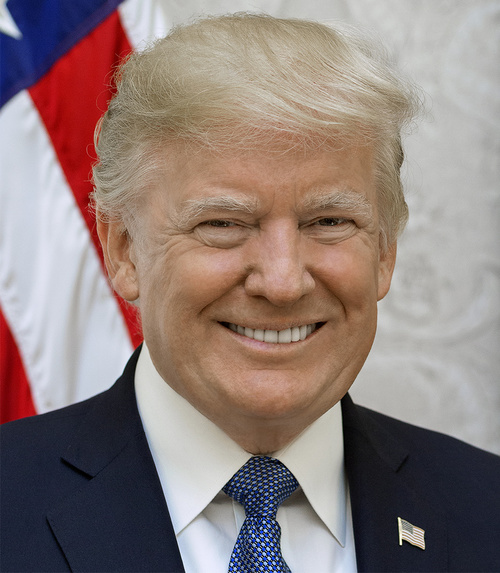
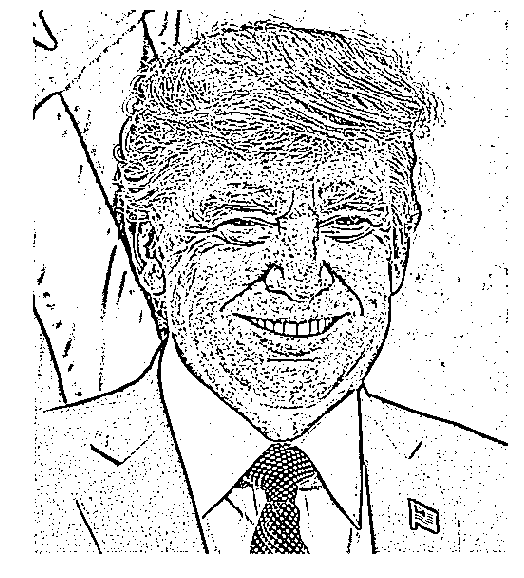
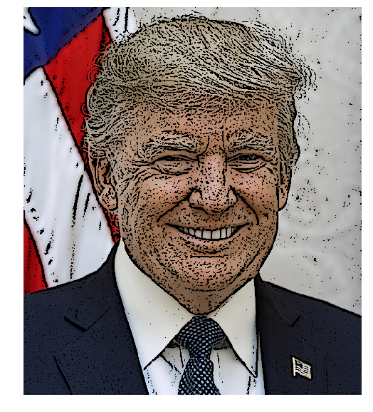

# 📸 Instagram-Style Filters with OpenCV

A Python project that recreates two popular Instagram-style image filters using OpenCV — a **Pencil Sketch** filter and a **Cartoon** filter. Built as part of an exploration into image processing fundamentals.

---

## 🖼️ Results

| Original | Pencil Sketch | Cartoon |
|----------|--------------|---------|
|  |  |  |

---

## 📖 Background

Instagram (a blend of *Instant Camera* and *Telegram*) launched in September 2010 and gained 1 million users within two months. It's famous for its wide library of photo filters — Clarendon, Gingham, Lark, Moon, X-Pro II, Nashville, and many more. Most of these filters work under the hood using techniques from color enhancement and curve adjustments.

This project focuses on two filters built from scratch using classical computer vision methods:

- **Pencil Sketch Filter** — Converts a color photo into a grayscale pencil-drawn sketch
- **Cartoon Filter** — Stylizes a photo to look like a cartoon drawing

---

## 🛠️ How It Works

### Pencil Sketch Filter

1. Convert the input image to **grayscale**
2. Apply a **Gaussian Blur** to smooth out fine details
3. Use **Adaptive Thresholding** to detect and highlight edges in a sketch-like style

The adaptive threshold intelligently adjusts the threshold value across different regions of the image, making it robust to varying lighting conditions — which is what gives the result that natural hand-drawn look.

### Cartoon Filter

1. Run the **Pencil Sketch** filter to get an edge mask
2. Copy the original color image
3. Set all pixels that are **not** part of an edge to black, preserving only the outlined regions

This produces a stark, graphic-novel style output where color appears only along detected contours.

---

## 🚀 Getting Started

### Prerequisites

```bash
pip install opencv-python matplotlib numpy
```

### Running the Script

1. Clone the repo:
```bash
git clone https://github.com/your-username/instagram-filters.git
cd instagram-filters
```

2. Place your image in the project directory and update the `imagePath` variable in `filters.py`:
```python
imagePath = "your_image.jpg"
```

3. Run the script:
```bash
python filters.py
```

Or open and run the Jupyter notebook:
```bash
jupyter notebook Instagram_filters.ipynb
```

---

## 📁 Project Structure

```
instagram-filters/
│
├── Instagram_filters.ipynb   # Jupyter notebook with full walkthrough
├── filters.py                # Standalone Python script
├── images/
│   ├── original.jpg          # Original input image
│   ├── pencil_sketch.jpg     # Pencil sketch output
│   └── cartoon.jpg           # Cartoon filter output
└── README.md
```

---

## 📦 Dependencies

| Library | Purpose |
|---------|---------|
| `opencv-python` | Core image processing operations |
| `matplotlib` | Displaying and saving image outputs |
| `numpy` | Array manipulation |

---

## 💡 Further Ideas

- Add **color pencil sketch** using `cv2.pencilSketch()` with custom shade factors
- Try a **bilateral filter** based cartoon effect for smoother color regions
- Experiment with other Instagram-style filters using **LUT (Look-Up Table)** color curves
- Build a simple GUI with `tkinter` or `streamlit` to apply filters interactively

---

## 📚 References

- [OpenCV Documentation](https://docs.opencv.org/)
- [Adaptive Thresholding](https://docs.opencv.org/4.x/d7/d4d/tutorial_py_thresholding.html)
- [Non-photorealistic Rendering in OpenCV](https://docs.opencv.org/4.x/df/dac/group__photo__render.html)

---

## 🧑‍💻 Author

Built as part of an image processing exploration project using Python and OpenCV.
